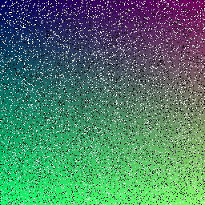
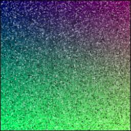

# 🧹 Filtro de Média para Remoção de Ruídos em Imagens

Este código aplica um **filtro de média (Box Blur 3x3)** para remover ruídos de uma imagem. Ele suaviza imperfeições leves, como granulações, tornando a imagem mais "limpa" visualmente.

---

## 🧠 O que o código faz?

1. **Abre a imagem original** com o nome `imagem2`.
2. **Converte para um array NumPy**, o que permite trabalhar pixel a pixel.
3. **Percorre cada pixel**, exceto as bordas.
4. Para cada pixel, **calcula a média dos 9 pixels vizinhos** (incluindo ele mesmo).
5. **Substitui o valor do pixel pela média**, suavizando a imagem.
6. **Converte o array suavizado de volta para imagem**.
7. **Salva a imagem final** como `imagem2modificada`.

---

## 👀 Comparação Visual

| Imagem Original | Imagem Suavizada |
|------------------|------------------|
|  |  |

---
