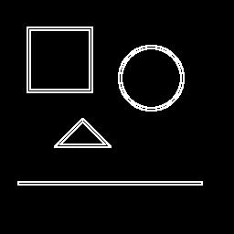

# 🖊️ Detecção e Realce de Bordas com Filtro de Prewitt

Este código aplica o **filtro de Prewitt** em uma imagem para detectar e realçar bordas. 
---

## 🧠 O que o código faz?

1. **Carrega a imagem original** chamada `imagem3`.
2. **Converte a imagem para tons de cinza**, utilizando a média ponderada dos canais R, G e B.
3. **Aplica os dois kernels do filtro de Prewitt**:
   - Um para detectar bordas na direção horizontal
   - Outro para detectar bordas na direção vertical
4. **Combina os resultados das duas direções** usando a magnitude do gradiente.
5. **Cria uma nova imagem realçada com as bordas detectadas**.
6. **Salva a imagem modificada** como `imagem3modificada`.

---

## 🔍 Comparação Visual

| Imagem Original | Bordas com Filtro de Prewitt |
|------------------|------------------------------|
|  |  |

---

## 🧪 Sobre o Filtro de Prewitt

O filtro de Prewitt é um método de detecção de bordas baseado na diferença de intensidades dos pixels vizinhos. Ele utiliza dois pequenos **kernels (máscaras)** para calcular mudanças bruscas na imagem:

- O **kernel horizontal** detecta bordas verticais.
- O **kernel vertical** detecta bordas horizontais.

A combinação dos dois resulta na detecção das bordas em todas as direções.

---
