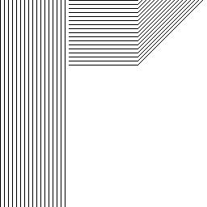
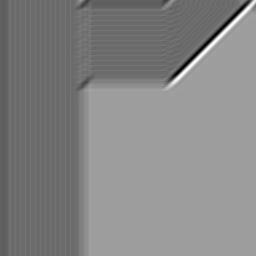

# 🎯 Filtro de Gabor para Realce de Textura e Orientação

O filtro de Gabor é utilizado para **detecção de padrões e texturas** em imagens, muito usado em visão computacional, reconhecimento de faces e análise de texturas biológicas.

---

## 🧠 O que o código faz?

1. **Carrega a imagem `imagem4`**.
2. **Converte a imagem para tons de cinza**, facilitando o processamento.
3. **Gera um kernel de Gabor** com parâmetros personalizáveis:
   - Tamanho do kernel
   - Orientação (ângulo em radianos)
   - Frequência (comprimento de onda)
   - Aspect ratio e fase
4. **Aplica uma convolução da imagem com o kernel de Gabor** para realçar padrões na direção escolhida.
5. **Converte o resultado para uma nova imagem e salva como `imagem4modificada`**.

---

## 🖼️ Comparação Visual

| Imagem Original | Imagem com Filtro de Gabor |
|------------------|-----------------------------|
|  |  |

---

## 📌 Quando usar Gabor?

Este filtro é ideal para:
- Identificar **frequências** e **orientações específicas** em texturas
- **Reconhecimento de impressões digitais**
- Análise de **fibras naturais** ou padrões repetitivos

---

## ⚙️ Parâmetros Utilizados

- `ksize`: 21
- `sigma`: 4.0
- `theta`: 45° (π/4)
- `lambd`: 10.0
- `gamma`: 0.5
- `psi`: 0

Esses valores podem ser ajustados para diferentes efeitos ou direções.

---

## 🎨 Resultado

Ao aplicar o filtro de Gabor, conseguimos destacar **regiões texturizadas** da imagem original com base na orientação escolhida, revelando padrões invisíveis a olho nu.

---
