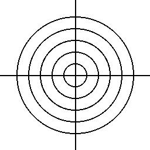
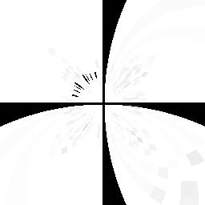

# 🌀 Filtro de Remapeamento (Distorção Radial)

Este filtro aplica uma **transformação de coordenadas** nos pixels da imagem original para gerar um efeito de distorção. É como "empurrar" ou "puxar" a imagem para o centro, criando uma **distorção circular suave**.

---

## 🧠 O que o código faz?

1. **Carrega a imagem original** chamada **`imagem5`**.
2. **Define o centro da imagem** como ponto de referência.
3. **Para cada pixel**, calcula sua distância ao centro.
4. Aplica uma **função de remapeamento radial**, alterando a posição dos pixels com base na distância.
5. **Gera uma nova imagem com efeito de distorção circular**.
6. **Salva como `imagem5modificada`**.

---

## 🔍 Comparação Visual

| Imagem Original | Imagem com Remapeamento |
|------------------|--------------------------|
|  |  |

---

## ✨ O que o remapeamento faz?

O remapeamento neste caso usa uma **função de distorção radial**, que faz com que os pixels mais afastados do centro sejam "puxados" ou "empurrados" para mais perto do centro, criando um efeito de:

- Lente de aumento
- Bolha
- Vórtice leve

---
