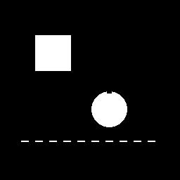
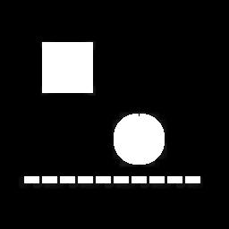

# 🧱 Filtro de Dilatação (Morfologia Matemática)

A dilatação é uma operação fundamental em **processamento morfológico**, utilizada para **engrossar regiões claras**, **fechar buracos** e **conectar elementos próximos** em uma imagem.

---

## 🧠 O que o código faz?

1. **Carrega a imagem `imagem6.jpg`** e converte para tons de cinza.
2. **Percorre cada pixel da imagem**, exceto as bordas.
3. Em cada posição, **verifica a vizinhança 3x3** em torno do pixel.
4. **Substitui o valor do pixel pelo maior valor da vizinhança** (máximo local).
5. Isso faz com que **áreas brancas “se espalhem”**, expandindo as formas.
6. **Salva a nova imagem como `imagem6modificada.jpg`**.

---

## 🔍 Comparação Visual

| Imagem Original | Após Dilatação |
|------------------|----------------|
|  |  |

---

## 💡 Para que serve a dilatação?

A dilatação é útil em várias situações, como:
- Preencher falhas em caracteres (OCR)
- Juntar objetos desconectados por pequenos espaços
- Melhorar o contorno de figuras
- Pós-processamento em **segmentação de imagens**

---

## 🧪 Efeito visual

✨ A operação **aumenta as áreas brancas e suaviza as quebras**.  
Quanto mais vezes for aplicada, **mais expandida** a forma fica.

---

## 🎛️ Dica

Você pode aplicar dilatação **mais de uma vez** ou combinar com erosão para criar filtros como:
- **Fechamento (Closing)**: Dilatação + Erosão
- **Abertura (Opening)**: Erosão + Dilatação

---
